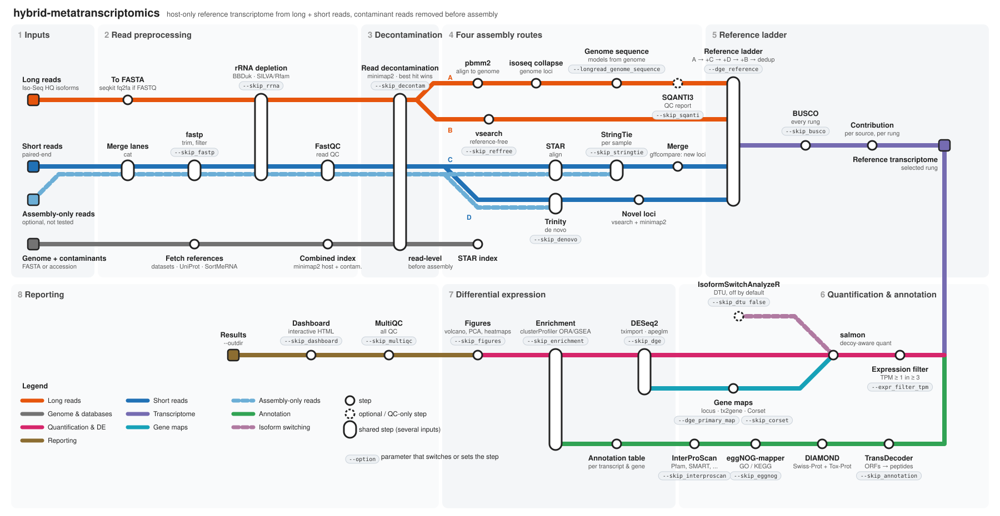

# Hybrid metatranscriptomics

A Nextflow (DSL2) workflow (`hybrid-metatranscriptomics`) that builds a **host-only reference
transcriptome from long + short reads**, with contaminant reads (e.g. symbiont) removed **before**
anything is assembled, then annotates it, quantifies it and tests it for differential expression.

It was developed for a *Cassiopea andromeda* UV-radiation experiment (a jellyfish holobiont with
Symbiodiniaceae symbionts). Every value that describes that experiment — the species, the
symbiont set, the treatments, the contrasts, the tool arguments — is a parameter, so the same
workflow runs another host/symbiont system. The workflow map, with every step, tool and option,
is in [§1](#1-what-it-does).

```bash
module load nextflow

# copy a params file and add your read samplesheets and outdir, then run it
cp assets/params_cassiopea_uv.yml my_params.yml      # or params_example_other_species.yml
nextflow run . -profile hpc,envmodules -params-file my_params.yml

# or everything on the command line (values shown are the Cassiopea run's)
nextflow run . -profile hpc,envmodules \
    --samplesheet            samplesheet_short.csv \
    --longread_samplesheet   samplesheet_long.csv \
    --genome_accession       GCA_018155075.1 \
    --contaminant_accessions GCA_977109205.1,GCA_965643015.1,GCA_947184155.2 \
    --reference_level        Control \
    --contrasts              contrasts.csv \
    --busco_lineage          cnidaria_odb12 \
    --eggnog_data_dir        /path/to/eggnog-mapper/data \
    --slurm_account          my_allocation \
    --outdir                 results

# validate the whole DAG in seconds, no tools needed
nextflow run . -profile test -stub-run
```

**Required:** `--samplesheet`, `--genome` or `--genome_accession`, `--eggnog_data_dir` (or
`--skip_eggnog`) and `--outdir`. **Set for your experiment:** the genomes whose reads are removed
before assembly (`--contaminant_accessions`, `--contaminant_fasta` or `--contaminant_dir`), and
`--longread_samplesheet` (or `--skip_longread`), `--contrasts` and `--busco_lineage`, whose
defaults are the Cassiopea run's example sheets and lineage. `--reference_level` defaults to the
first level alphabetically.

**On SLURM**, `run_slurm.sh` is a small driver job that launches Nextflow and waits, so a long run
outlives an interactive session's wall limit. It reads `PROJ`, `PARAMS_FILE`, `SITE_CONFIG` and
`NF_PROFILE` from the environment; see the script's header.

---

## 1. What it does



**Why contaminant removal comes first.** Separating host from symbiont *after* assembly cannot
undo what the assembler already did: chimeric contigs and conserved shared regions are baked in.
Removing the reads first means the assembly graph only ever sees host data. The removal is
*competitive* — host and contaminant genomes go into one index, so each read's primary alignment
is its best placement genome-wide. A conserved host read that also aligns to a contaminant still
scores best on the host and is kept; reads that align nowhere are kept too, because on a
fragmented draft genome unmapped is not evidence of contamination. Only a positive contaminant
placement removes a pair.

**Why four assembly sources.** Each recovers loci the others miss: long reads give real isoform
structure but sample the transcriptome shallowly; the genome-guided short-read assembly finds
loci the long reads did not reach; de novo assembly finds loci absent from a draft genome.
The ladder measures what each one was worth instead of hiding it in one merge.

---

## 2. Inputs

### Short reads — `--samplesheet`

```csv
sample,condition,replicate,fastq_1,fastq_2
S01_Control_B,Control,B,/data/…_L001_R1_001.fastq.gz,/data/…_L001_R2_001.fastq.gz
S01_Control_B,Control,B,/data/…_L002_R1_001.fastq.gz,/data/…_L002_R2_001.fastq.gz
S02_Control_D,Control,D,/data/…_L001_R1_001.fastq.gz,/data/…_L001_R2_001.fastq.gz
```

Several rows with the same `sample` are units (lanes) of one library and are merged. The factor
column is named by `--condition_column`, so any column name works. Paired-end only.

### Long reads — `--longread_samplesheet`

```csv
sample,condition,reads
HQ_isoforms_pooled,pooled,/data/HighQualityIsoforms.fasta
```

FASTA or FASTQ, gzipped or not. Several samples are pooled for reference building — long-read
libraries are usually few and unreplicated, and isoform discovery benefits from the pooled depth —
but each one is prepped, rRNA-screened and **accounted for separately**, so the report carries
per-sample long-read statistics as well as the pooled totals. Set `--skip_longread` for a
short-read-only run; the ladder then starts from StringTie.

**Long reads that were already pooled before you got them** (a polished Iso-Seq transcript set,
say) carry no per-sample identity. Point `--longread_membership` at a `sequence_id<TAB>sample`
table to restore it, and the same per-sample accounting applies:

```bash
# from a PacBio run's per-barcode FL count matrix
extra/pacbio_fl_counts_to_membership.py --counts run.transcripts.fl_counts.csv \
    --names Control,UVB,UVR --out membership.tsv
nextflow run . --longread_membership membership.tsv
```

A sequence detected in several samples is counted once per sample — it was genuinely present in
each — so those columns sum to more than the pooled total, and the table says so. The Cassiopea
run passes `--longread_membership` with a table built from the Iso-Seq run's own FL counts
(`extra/pacbio_fl_counts_to_membership.py`), which turns one pooled HQ FASTA into three per-condition samples without
changing what the reference is built from.

### Assembly-only short reads — `--assembly_samplesheet`

Same columns as `--samplesheet`. These libraries go through the same preprocessing (fastp →
rRNA → decontamination) and into the two short-read assembly routes (StringTie, Trinity), but
are **never quantified or tested** — use them for extra assembly depth, e.g. public libraries
from another study of the same species. Their preprocessing tables are published as
`qc/*_assembly_only.tsv` and the dashboard draws them as a dashed input box. The Cassiopea run
uses it for the two Gacesa et al. libraries (SRR10388048/49); `assets/samplesheet_assembly_gacesa.csv`
shows the layout — download the reads and set `assembly_samplesheet` to your copy.

### References

Every reference is either a path you give or something the pipeline downloads.

| What | Give a path | …or let it download |
|---|---|---|
| Reference genome | `--genome` | `--genome_accession` (NCBI `datasets`) |
| Contaminant genomes | `--contaminant_fasta` or `--contaminant_dir` (a folder of FASTAs, concatenated) | `--contaminant_accessions` (comma-separated) |
| rRNA database | `--rrna_fasta` | default: the SortMeRNA v4.3 set (`--rrna_db_sets`) |
| Protein DBs | `--diamond_db_dir` (a folder of `.dmnd`) | `--swissprot_url` + `--specialist_url` |
| STAR index | `--star_index` | built from the genome |
| BUSCO lineage | `--busco_download_path` (cache) | BUSCO fetches `--busco_lineage` |

Leave all three contaminant parameters unset to skip decontamination entirely.

### Design

```csv
id,factor,level,reference
UVB_vs_Control,condition,UVB,Control
UVAUVB_vs_Control,condition,UVAUVB,Control
UVAUVB_vs_UVB,condition,UVAUVB,UVB
```

`--design` is the DESeq2 formula (`~ condition`, `~ batch + condition`, …), `--reference_level`
the baseline. Without a contrasts file, every level is tested against the reference level.

---

## 3. Output

```
results_nf/
├── dashboard/index.html         ← start here: the interactive run report (§3.1)
├── run_summary.txt              ← the same headline numbers as plain text, with their source files
├── assembly/                    per-route assemblies (Iso-Seq, StringTie, Trinity, reference-free)
├── transcriptome/
│   ├── isoseq.fasta … all_sources_dedup.fasta   ← the reference ladder, one FASTA per rung
│   ├── all_sources_dedup_expressed.fasta         ← the quantification (DE) reference
│   ├── tx2gene.<set>.tsv          ← string-stripped map (an UPPER BOUND on distinct loci)
│   ├── tx2gene.<set>_locus.tsv    ← genomic-locus map, the default primary map (see §5)
│   ├── tx2gene.<set>_corset.tsv   ← Corset read-sharing map (see §5)
│   ├── locus_rebuild_report.txt
│   └── qc/  BUSCO and stats for every rung
├── annotation/                  annotation.<set>.tsv (+ summary), peptides, CDS, raw searches
├── quantification/              per-sample salmon output, mapping_rates.tsv, Corset output
├── dge/ dge_locus/ dge_corset/  DESeq2 results per contrast + DE_summary.csv, one per gene map
├── enrichment/ enrichment_locus/ enrichment_corset/
├── decontam/                    combined-index log, long-read classification, residual audits
├── qc/                          fastp, FastQC, rRNA, per-sample decontamination, MultiQC
├── figures_<set>/               PDF + 300 dpi PNG
└── pipeline_info/               timeline, report, trace, DAG
```

`run_summary.txt` includes the end-to-end accounting check: the fragments salmon processed must
equal the read pairs that survived decontamination.

### 3.1 The dashboard

`dashboard/index.html` is a single self-contained file — no CDN, no server, no network. Copy it,
email it, open it from a USB stick; it works offline and prints. It is built by the `DASHBOARD`
process from the run's own outputs plus `pipeline_info/run_manifest.json`, so it always describes
*this* run rather than the pipeline in general.

| Tab | What it holds |
|---|---|
| **Overview** | the headline figure, then **one panel per dataset** — split into *Data in* (short reads, long reads, the reference genome, the contaminant set) and *Results out* (the reference transcriptome, annotation, expression). Each panel carries that dataset's basic facts, a funnel of what survived each filter where that applies, and a link to the tab that shows the detail. Below them: the end-to-end read-accounting check, the run as a rail of its own numbers (click a stage to jump to its method), and the caveats that this run's own numbers earn |
| **Methods** | every stage as it actually ran: **the arguments come from this run's parameters**, the rationale explains why the step exists, the metrics are what it produced. Skipped stages stay listed so the shape of the run is visible |
| **Reads & QC** | per-sample stacked bars of what survived rRNA depletion and decontamination, mapping rates, then the same per-sample view for the **long reads** — what survived, and where each sample's isoforms placed (host / no alignment / contaminant / ambiguous) — plus the pooled classification the reference was built from |
| **Reference** | the ladder (transcripts or genes, toggled) and BUSCO completeness per variant |
| **Annotation** | evidence per transcript, and the annotation summary |
| **Expression** | DE counts, sample PCA, an interactive volcano and the enrichment terms — the contrast selector scopes everything below it |
| **Genes** | the two gene-count bounds with their validation metrics, a searchable, sortable table of the top DE genes joined to their annotation, and **interactive volcano plots** whose padj and \|log2FC\| thresholds you set — one plot per contrast as small multiples, or one large plot when a single contrast is selected |
| **Provenance** | the run's metadata, every parameter it used, links to the other reports, and the files this page was built from |

Every Overview panel is derived, never listed: a short-read-only run shows one input panel, a run
without annotation drops that panel, and a run with nothing in it degrades to the pipeline rail
alone. The headline figure follows the same rule — the reference transcript count when a reference
was built, otherwise the DE-gene count, otherwise the reads kept.

The Genes tab's contrast, direction and threshold fields scope both the table and the volcanoes,
so the two always agree; the text search narrows the table only, and the page says so. Every gene
with `padj` below the embedding ceiling (`--sig-ceiling`, default 0.25) is plotted in full, so the
live up/down counts are **exact** at any threshold up to it — verified against DESeq2's own
summary (558/317, 488/213, 171/143 at padj < 0.05, |log2FC| ≥ 1, and 1,001/657 at the ceiling).
Only the clearly non-significant cloud is sampled down, and it is context that is never counted.

Every chart has a **table view** (the `Table` button on each card), a hover/focus tooltip, and a
legend — nothing is encoded by colour alone. The palette is validated for colour-vision
deficiency in both light and dark mode with the `dataviz` skill's validator; the theme follows the
system and can be pinned with the toggle in the header.

Build it outside a pipeline run — after editing a table by hand, say — with:

```bash
bin/build_dashboard.py --dir <a directory of pipeline outputs> \
    --manifest results_nf/pipeline_info/run_manifest.json \
    --out dashboard/index.html --title 'My run'
```

`--skip_dashboard` turns it off; `--dashboard_title` sets the heading.

---

## 4. Configuration

| File | What it holds |
|---|---|
| `nextflow.config` | every parameter and its default |
| `assets/params_cassiopea_uv.yml` | the Cassiopea experiment (`-params-file`); no paths |
| `assets/params_example_other_species.yml` | the same layout for another species |
| `conf/base.config` | resource tiers per process label |
| `conf/modules.config` | everything per process: `ext.args` (tool command lines), publishing rules, and which module / conda package provides the tool |
| `conf/envmodules.config` | one switch: `use_modules`. The module names live in `params.mod` |
| `conf/conda.config` | one switch: `use_conda_pkgs`. The packages live in `params.conda_pkg` |
| `conf/hpc.config` | SLURM account, partition, queue limits |
| `conf/test.config` | tiny resources for `-stub-run` |

Change a tool's version in one place:

```bash
nextflow run . -profile hpc,envmodules --mod.minimap2 minimap2/2.31
```

All four per-process settings — arguments, publishing, module, conda — deliberately live in the
same file. A `withName:` block declared in a *profile* **replaces** the base config's block for
that process, `ext.args` and `publishDir` included, so splitting provisioning into a profile
silently drops the tool arguments and scatters the outputs. That bug was live here until the
layout above; `nextflow config -profile hpc,envmodules` now resolves to exactly the same
per-process settings as the bare run, which is what the test below checks.

Change a tool's arguments without touching the workflow, in your own config:

```groovy
process {
    withName: 'STAR_ALIGN' { ext.args = '--twopassMode Basic --outFilterMismatchNoverLmax 0.04' }
    withName: 'TRINITY'    { cpus = 48; memory = '400.GB' }
}
```

Tools with no module on a given cluster (here TransDecoder and gffread) come from
`--extra_path`, which is prepended to `PATH` for exactly the processes that need them.

---

## 4. Resources and parallelism

Nextflow is a dataflow engine: **anything whose inputs are ready runs at once**, as separate SLURM
jobs. Concretely, in this pipeline that means

* the 15-sample stages fan out — `FASTP`, `BBDUK_RRNA_PE`, `FASTQC`, `DECONTAM_SHORT`,
  `STAR_ALIGN`, `STRINGTIE`, `SALMON_QUANT` each run as 15 concurrent jobs;
* the long-read branch (`PBMM2_ALIGN` → `ISOSEQ_COLLAPSE`, and `CDHIT_EST` reference-free) runs
  alongside the short-read branch;
* the four assembly sources are independent until they are layered: Trinity runs while STAR and
  StringTie do, and both run while the long-read routes do;
* the three annotation searches — DIAMOND (one job per database), eggNOG-mapper, InterProScan —
  all start as soon as TransDecoder finishes, instead of being chained;
* BUSCO scores all six reference variants simultaneously, and the locus rebuild runs beside DESeq2.

The real serialisation points are the ones the biology imposes: the combined index before
per-sample decontamination, the ladder (each rung needs the one below it), and the reference
before quantification. `executor.queueSize` (64 in `conf/hpc.config`) caps how many jobs are
queued at once.

Resources are **set per process from measured need**, not from one generic tier — a 250 GB request
for a 15-way fan-out would mean each task waits for a nearly empty node, so the fan-out serialises
in the queue. The values come from the two completed runs of this dataset (`sacct`: allocated
CPUs, requested memory, elapsed) and are recorded with their evidence in `conf/modules.config`:

| Process | cpus | memory | typical runtime | basis |
|---|---:|---:|---|---|
| `TRINITY` | 32 | 250 GB | **9 h 18 m** | measured at exactly this size |
| `INTERPROSCAN` | 32 | 96 GB | 45–70 min | measured |
| `CDHIT_EST` / `CDHIT_2D` | 32 | 200 GB | up to ~1 h | `-M 0` takes what it needs |
| `DIAMOND_BLASTP`, `EGGNOG_MAPPER` | 24 | 96 GB | ~30 min | measured together at 24 / 120 GB |
| `DECONTAM_SHORT` (×15) | 24 | 96 GB | ~8 min each | original run used 24 / 150 GB |
| `STAR_ALIGN` (×15) | 16 | 64 GB | 6–32 min each | measured at exactly this size |
| `SALMON_QUANT` (×15) | 12 | 32 GB | 2–10 min each | measured at exactly this size |
| `BUSCO` (×6) | 24 | 64 GB | 1–73 min | measured at exactly this size |
| `DESEQ2`, `ENRICHMENT`, `FIGURES` | 8 | 48 GB | 2–15 min | single-threaded R |
| table/summary steps | 1–2 | 4–16 GB | seconds | one pass over small files |

Memory and time scale with `task.attempt`, so a task that dies on memory is retried larger rather
than failing the run, and every value is capped by `--max_cpus` / `--max_memory` / `--max_time`.
On a typical mixed-node SLURM partition (e.g. nodes of 40 cpus / 329 GB, 128 / 457 GB, 192 / 713 GB)
these sizes let several tasks share a node instead of each holding one.

Trinity is the critical path: expect the whole run to be dominated by it.

## 5. Gene identity — read this before quoting a gene count

Three gene maps are produced. `--dge_primary_map` (default `locus`) names the one the headline
numbers come from; the other two are run through DE and enrichment as sensitivity arms.

* `tx2gene.<set>.tsv` strips isoform suffixes from transcript ids. The rule differs per assembly
  source and nothing reconciles identity **across** sources, so a locus recovered by three
  sources is counted three times. This is an **upper bound** on distinct loci.
* `tx2gene.<set>_locus.tsv` places every transcript on the genome and groups connected components
  of transcripts sharing a splice junction (`--locus_groupby junction`, the conservative default)
  or an exon (`exon`). Transcripts that do not place (`--locus_mincov`) keep their own `LOCUSU_`
  gene. This removes most of the split-gene problem at the cost of some fusion, because tandem
  duplicates and nested genes can merge on a fragmented draft.
* `tx2gene.<set>_corset.tsv` clusters transcripts on shared reads (salmon equivalence classes).
  It is run **label-free** (`--corset_use_groups false`): with `true` Corset's likelihood-ratio
  test splits clusters on the very conditions DESeq2 then tests, which is circular.

`locus_rebuild_report.txt` reports both error directions: **genes per protein accession** above
1.00 means under-merging; **loci carrying more than one distinct accession** means over-merging. It
also lists the largest loci with their members' protein descriptions — a locus whose top
descriptions disagree is a likely over-merge. Raise `--locus_mincov` if too many do.

**Why `locus` is the default.** On the *C. andromeda* run each map was scored against
label-free truth: BUSCO single-copy orthologs and the Gacesa et al. genome gene models.
Fraction of same-gene transcript pairs a map puts in one gene:

| map | genes | BUSCO pair recall | Gacesa pair recall | wrong merges |
|---|---|---|---|---|
| locus | 29,709 | 0.81 | 0.73 | ≤ 1% |
| Corset, label-free | 32,565 | 0.74 | 0.69 | ≤ 1% |
| string-stripped | 34,895 | 0.44 | 0.34 | ≤ 1% |
| Corset, `-g condition` | 38,541 | 0.35 | 0.25 | ≤ 1% |

On a label-shuffle null (10 shuffles), Corset with `-g condition` called 89 false DE genes per
shuffle against 56 for locus and 60 for label-free Corset — hence the label-free default.

---

## 6. Comparison against a published reference — deliberately outside the pipeline

Which published reference counts as authoritative is an interpretation choice, it changes as new
references appear, and it must not silently alter pipeline outputs on a re-run. So it is a
standalone script that consumes a finished run:

```bash
extra/compare_to_published.sh results_nf /path/to/published_transcriptome.fasta \
    results_nf/comparison [reference_annotation.tsv]
```

It buckets each gene as `matched` / `annotation_gap` / `novel_locus_annotated` /
`novel_locus_unannotated` and flags the differentially expressed ones. Three caveats that
materially change the novelty rate are documented in `extra/novelty_vs_reference.py` — chiefly
that a published *transcriptome* makes genes the authors annotated but did not express look
novel, and that coverage measured on our transcript penalises short de novo fragments.


## 7. Repository Layout

```
main.nf                     workflow entry point, samplesheet parsing, reporting
subworkflows/local/         prepare_references, read_preprocess, build_transcriptome,
                            annotate, quantify_and_dge
modules/local/              references, shortread_qc, decontam, assembly, annotation,
                            quant, dge, reporting  (every process has a stub)
bin/                        analysis scripts on PATH inside every task
                            (build_dashboard.py renders the dashboard from a run's outputs)
assets/                     example samplesheets, contrasts, and the params files
                            (params_cassiopea_uv.yml, params_example_other_species.yml)
extra/                      out-of-pipeline tools: the comparison against a published
                            reference, the PacBio FL-count → membership converter, the
                            dashboard smoke test, and the metro-map generator
conf/                       see §4
run_slurm.sh                SLURM driver job that launches and waits for a run
```
